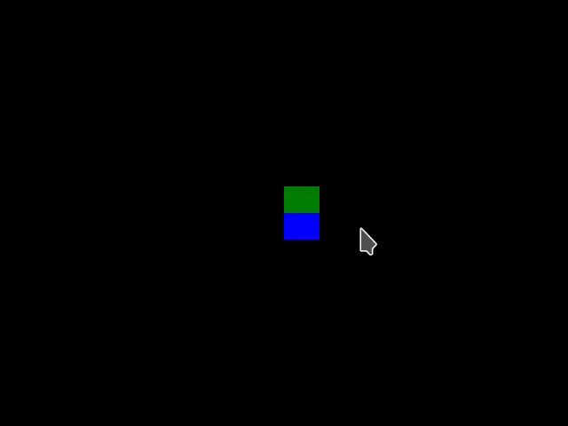

# Snake

简单而且简陋的贪吃蛇小游戏，由 [tetris](https://github.com/enter-tainer/tetris) 和 [minesweeper](https://github.com/ikitsuchi/minesweeper) 启发而来。



## 依赖

- clang
- SDL2

> SDL2 用于在 x86_86 机器上模拟 VGA 输出

## 编译运行

- 在 x86_64 机器上运行：

```console
$ make simulate=on
$ ./main
```

- 编译到 RISC-V（计划支持，代码编写中）：

```console
$ make
```
